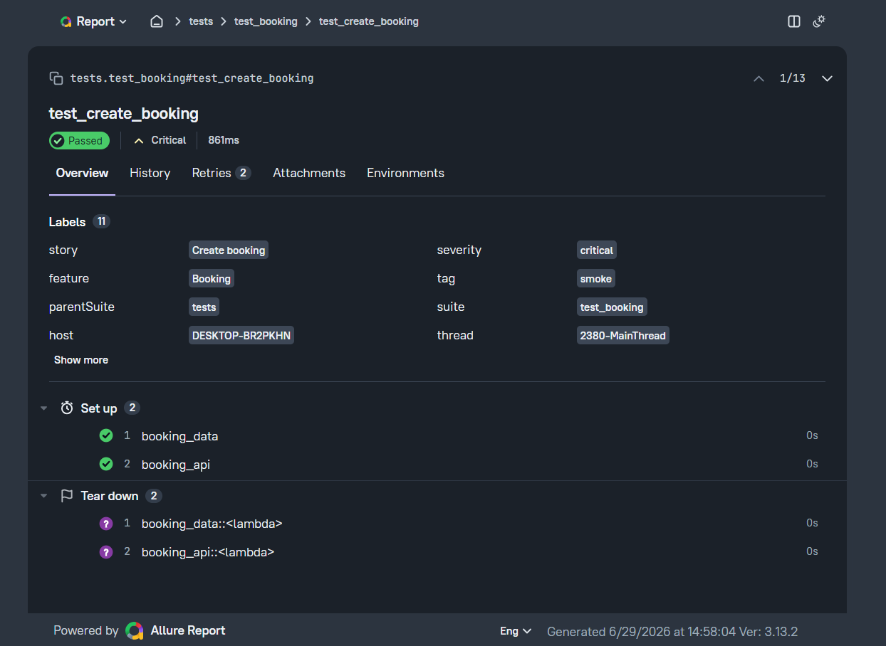

# Booking API Test Automation Framework


A REST API test automation framework built with **Python**, **Pytest**, and **Requests** for testing the **Restful Booker API**.

This project demonstrates a scalable API automation framework using clean architecture, reusable components, CI/CD integration, and industry-standard QA Automation practices.

---

# Features

* REST API testing
* CRUD operations
* Reusable HTTP client
* API endpoint abstraction
* Pytest fixtures with setup/teardown
* Positive and negative test scenarios
* Smoke and regression test suites
* Data models using Dataclasses
* Custom assertion helpers
* Allure reporting
* GitHub Actions CI
* Clean and scalable project architecture

---

# Tech Stack

* Python 3.x
* Pytest
* Requests
* Dataclasses
* Allure Report
* Git
* GitHub Actions

---

# API Under Test

**Base URL**

```
https://restful-booker.herokuapp.com
```

The framework automates testing of the public Restful Booker API, covering booking creation, retrieval, update, deletion, authentication, and error handling scenarios.

---

# Project Structure

```text
booking-api-test-framework/
│
├── api/
│   └── booking_api.py          # Booking API endpoint wrappers
│
├── client/
│   └── api_client.py           # Reusable HTTP client
│
├── models/
│   └── booking_models.py       # Request/response data models
│
├── tests/
│   ├── test_booking.py
│   ├── test_get_booking.py
│   └── test_delete_booking.py
│
├── utils/
│   └── assertions.py           # Custom assertion helpers
│
├── reports/
│   └── allure/
│
├── docs/
│   └── allure_report.png
│
├── conftest.py                 # Shared Pytest fixtures
├── pytest.ini
├── requirements.txt
├── .gitignore
└── README.md
```

---

# Architecture

The framework follows a simple **three-layer architecture**.

### APIClient

Responsible only for HTTP communication.

* GET
* POST
* PUT
* PATCH
* DELETE

No business logic is implemented in this layer.

---

### BookingAPI

Provides endpoint wrappers for the Booking API.

Responsibilities:

* build endpoint URLs
* call HTTP client methods
* expose reusable API operations

This layer contains **no assertions or test logic**.

---

### Tests

All verification logic is implemented inside the test layer.

Responsibilities:

* validate HTTP status codes
* validate response payloads
* verify business rules
* execute positive and negative scenarios

---

# Test Coverage

## Smoke Tests

* Create booking
* Get booking by ID
* Get all bookings
* Update booking
* Delete booking

## Regression Tests

* Get nonexistent booking
* Get booking with negative ID
* Create booking with invalid payload
* Create booking with missing required fields
* Update booking without authentication
* Update booking with invalid token
* Delete booking without authentication
* Delete nonexistent booking

---

# Installation

Clone the repository.

```bash
git clone https://github.com/sqveren/booking-api-test-framework.git
cd booking-api-test-framework
```

Create a virtual environment.

```bash
python -m venv .venv
```

Activate it.

### Windows

```bash
.venv\Scripts\activate
```

### Linux / macOS

```bash
source .venv/bin/activate
```

Install project dependencies.

```bash
pip install -r requirements.txt
```

---

# Running Tests

Run the complete test suite.

```bash
pytest -v
```

Run only smoke tests.

```bash
pytest -m smoke
```

Run only regression tests.

```bash
pytest -m regression
```

---

# Allure Report

Generate Allure results.

```bash
pytest --alluredir=reports/allure
```

Open the report.

```bash
allure serve reports/allure
```

Example report:




---

# Continuous Integration

The project uses **GitHub Actions** to automatically:

* install dependencies
* run the complete test suite
* validate every push
* validate every pull request

---

# Future Improvements

* Docker support
* Environment configuration
* Parallel test execution
* API schema validation
* Test data generation with Faker
* Performance API testing
* JSON Schema validation
* Automatic test reporting

---

# Author

**Yurii**

Junior QA Automation Engineer

GitHub: https://github.com/sqveren
