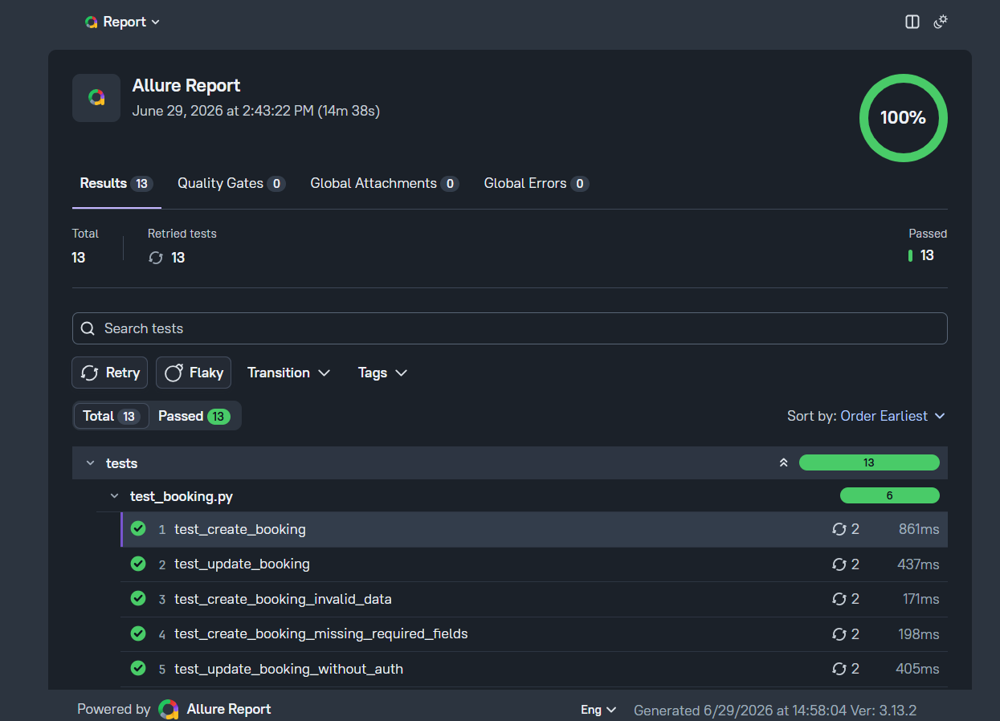

# Booking API Test Automation Framework

REST API test automation framework built with **Python**, **Pytest**, and **Requests** for testing the Restful Booker API.
---

## Features

* REST API testing
* CRUD operations for Booking API
* Reusable HTTP client
* API endpoint abstraction
* Pytest fixtures
* Positive and negative test scenarios
* Smoke and regression test suites
* GitHub Actions CI
* Clean and scalable project structure

---

## Tech Stack

* Python 3.14
* Pytest
* Requests
* Dataclasses
* Git
* GitHub Actions

---

## Project Structure

```text
booking-api-test-framework/
│
├── api/
│   └── booking_api.py          # Booking API endpoint wrappers
│
├── client/
│   └── api_client.py           # HTTP client built on Requests
│
├── models/
│   └── booking_models.py       # Request/response data models
│
├── tests/
│   ├── test_create_booking.py
│   ├── test_get_booking.py
│   ├── test_update_booking.py
│   └── test_delete_booking.py
│
├── utils/
│   ├── assertions.py
│   └── data_generator.py
│
├── conftest.py                 # Shared fixtures
├── pytest.ini
├── requirements.txt
├── .gitignore
└── README.md
```

---

## Architecture

The framework follows a simple three-layer architecture.

### APIClient

Responsible only for HTTP communication.

* GET
* POST
* PUT
* PATCH
* DELETE

### BookingAPI

Contains endpoint wrappers for the Booking API.

Responsibilities:

* build endpoint URLs
* call APIClient methods
* provide reusable API methods

No business validations or assertions are implemented here.

### Tests

Test files contain all verification logic.

Responsibilities:

* validate status codes
* validate response payloads
* validate business rules
* verify positive and negative scenarios

---

## Test Coverage

### Smoke Tests

* Create booking
* Get booking by ID
* Update booking
* Delete booking
* Get all bookings

### Regression Tests

* Get nonexistent booking
* Create booking with invalid payload
* Update booking without authentication
* Update booking with invalid token
* Delete booking without authentication

---

## Installation

Clone the repository.

```bash
git clone https://github.com/sqveren/booking-api-test-framework.git
```

Go to the project directory.

```bash
cd booking-api-test-framework
```

Create a virtual environment.

```bash
python -m venv .venv
```

Activate it.

Windows

```bash
.venv\Scripts\activate
```

Linux / macOS

```bash
source .venv/bin/activate
```

Install dependencies.

```bash
pip install -r requirements.txt
```

---

## Running Tests

Run all tests.

```bash
pytest
```

Verbose mode.

```bash
pytest -v
```

Run only smoke tests.

```bash
pytest -m smoke
```

Run only regression tests.

```bash
pytest -m regression
```

Generate HTML report.

```bash
pytest --html=report.html
```

---

## Continuous Integration

The project uses GitHub Actions to automatically:

* install dependencies
* execute test suite
* validate every push and pull request

---

## Future Improvements

* Authentication support
* Environment configuration
* Allure reporting
* Logging
* Request/response models
* Test data generation
* Docker support
* Parallel test execution
* API schema validation

---

## Learning Goals

This project was created to practice:

* API Test Automation
* Python
* Pytest
* REST API testing
* Test framework architecture
* Git & GitHub
* Continuous Integration
* Clean code principles

## Test Report




Junior QA Automation Engineer
